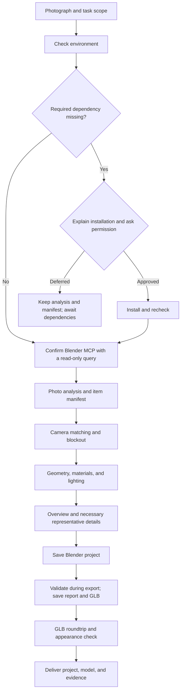

# Blender Photo Scene

[简体中文](README.md) · English

A Codex skill for reconstructing a photographed space as an editable Blender scene, with individually movable objects. An agent interprets the photograph, builds or adapts geometry, arranges materials and lighting, and checks the result.

The photograph guides content and placement. An item manifest connects each object to its model, movement checks, and exported identity. Camera matching and spatial proportions come before fine detail. Uncertain dimensions and hidden surfaces are recorded as estimates.

## What you receive

- A `.blend` project with editable geometry, the reference camera, lighting, materials, and necessary packed images.
- A `.glb` scene containing registered items with stable IDs and independent transforms.
- A build script, a photo-view preview, and representative detail images.
- Item and asset manifests, source attribution, and a concise acceptance report with evidence and outstanding limitations.

Each complete small object is one mesh object, selectable and movable as a whole in Object Mode. Material regions and disconnected mesh islands can remain inside it. Repeated objects retain separate identities and transforms. Movable items have plausible sides, backs, and undersides; surfaces revealed when they move are completed.

The Blender project and its renders carry the authored presentation. The GLB provides a portable object scene, with its imported appearance checked separately.

## Install and use

Ask Codex:

```text
$skill-installer Install the skill at https://github.com/yuzisama224/blender-photo-scene/tree/main with the name blender-photo-scene.
```

The repository root is the skill directory. Installation adds instructions and helper scripts. Production also needs Blender, a working Blender MCP connection available to the agent, and Python for relevant helper tools. See [tool setup and commands](references/scripts.md) and the [official OpenAI skills documentation](https://learn.chatgpt.com/docs/build-skills).

The agent checks existing software and confirms MCP through a read-only scene query. If Blender or a dependency required for the current step is missing, it explains the missing items, affected work, and proposed installation method and location, then asks for permission. Installation requires explicit consent. Optional diagnostic dependencies are handled when needed; connection failures are investigated first.

Attach a photograph, then use a prompt such as:

```text
$blender-photo-scene Reconstruct this photograph as an editable Blender scene.
Make every small object independently selectable, movable, and rotatable.
Deliver the Blender project, GLB, previews, and acceptance report.
Write the scene notes and report in English.
```

Provide known measurements, viewing distance, or a target project when relevant. The [skill instructions](SKILL.md) and modules are in Chinese; task notes and reports default to Chinese unless you request another language.

## Workflow

| Stage | Work and evidence |
| --- | --- |
| Inspect | View the photograph and existing scene; record scope, item identities, measurements, and assumptions. |
| Match | Set the camera and spatial proportions; compare a blockout preview with the photograph before detailing. |
| Build | Refine silhouettes, thickness, connections, and hidden surfaces; organize complete movable items. |
| Finish | Add UVs, materials, textures, and lighting; inspect the overview and representative close-ups. |
| Validate and export | Save the project; validate the authored scene inside the export step; export registered items. |
| Reimport and deliver | Read the GLB in a fresh Blender process; compare against the saved baseline, test movement, inspect appearance, and report results. |



The diagram shows the main delivery path. Within each stage, specific issues trigger corrections and checks of affected work. Export and roundtrip checks must pass before delivery. See the [production workflow](references/workflow.md) and [manifest contract](references/manifest.md).

## Focused quality checks

The default path combines stage previews, one authored validation during export, and one GLB roundtrip validation. Both technical validations cover all registered items and test every movable item by translating, rotating, and restoring it while checking effects on other objects.

Visual evidence is reused while it remains valid. Repeated items can share representative geometry and material evidence; their identities, counts, and placement are still checked individually. Seven-view renders, masks, overlays, and detailed mesh diagnostics are used to resolve specific uncertainties. Changes trigger checks of affected content; changes to the deliverable require an updated export and roundtrip.

Full logs and per-item data stay in files. Reports summarize conclusions, exceptions, inspection coverage, and evidence paths. Technical success and observed visual quality are recorded separately. See [acceptance rules](references/modules/qa.md).

## Bundle layout

| Path | Contents |
| --- | --- |
| [SKILL.md](SKILL.md) | Agent entry point and stage routing |
| [references/](references/) | Workflow, manifest, tool guide, and specialist modules |
| [scripts/](scripts/) | Preflight, export, validation, and optional diagnostic tools |
| [tests/](tests/) | Package and helper-script tests for maintenance |
| [agents/openai.yaml](agents/openai.yaml) | Codex skill metadata |
| [UPSTREAM.json](UPSTREAM.json) and [licenses/](licenses/) | Pinned sources, adaptation records, and preserved licenses |

## License and attribution

Distributed under the [MIT License](LICENSE). Adapted material retains attribution and license notices from [arjun988/blender-skills](licenses/arjun988-blender-skills-LICENSE), [RobLe3/cc-blender-skill](licenses/RobLe3-cc-blender-skill-LICENSE), [ifBars/blender-agent-studio](licenses/ifBars-blender-agent-studio-LICENSE), and [CheshireJCat/create-3d-model-skill](licenses/CheshireJCat-create-3d-model-skill-LICENSE). [UPSTREAM.json](UPSTREAM.json) records source repositories, fixed commits, file mappings, and adaptations. Assets obtained for an individual scene have their own recorded licenses.
