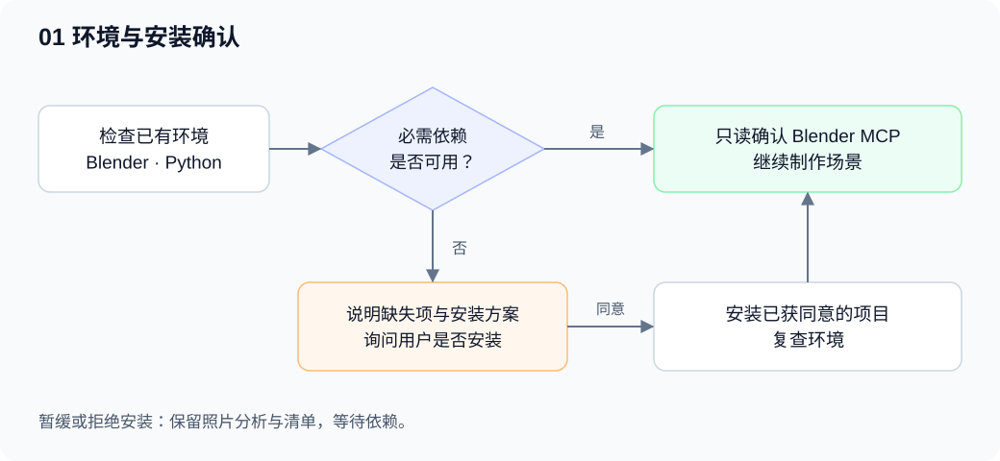
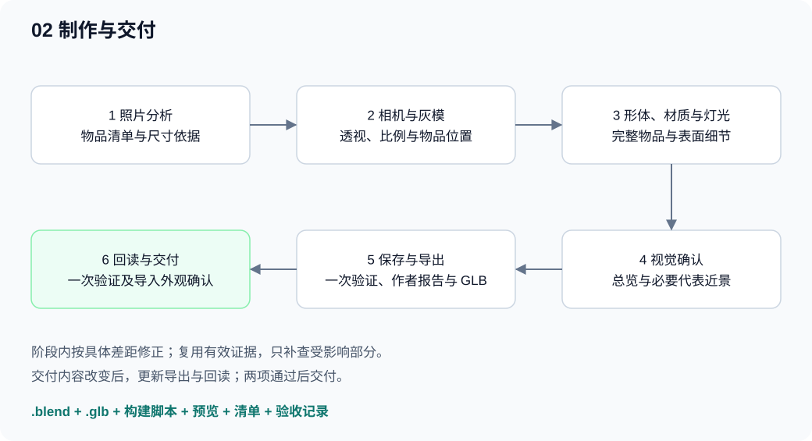

# Blender Photo Scene

**中文** · [English](README.en.md)

从参考照片制作可编辑的 Blender 场景，让空间、固定设施与小物品形成完整的三维资产。每件小物品都能在对象模式中直接选中、整体移动和旋转，默认交付 `.blend` 工程与 `.glb` 模型。

这是供 Codex 使用的技能包：通过照片分析、分阶段建模与少量必要检查，指导 agent 操作 Blender。照片决定内容和摆放，物品清单贯穿制作、独立移动与导出回读。

## 能做什么

- 按照片匹配相机透视、空间比例、物品数量与遮挡关系。
- 制作可近距离查看的形体、接合、厚度、UV、材质和灯光。
- 将每件完整物品整理为一个带稳定 ID 的网格对象，保留多材质与有意义的可编辑结构。
- 补齐合理的侧面、背面、底部，以及物品移开后露出的承托面。
- 复用有效预览，针对具体疑点补充检查，并验证导出后物品仍可独立使用。

## 安装与使用

在提供 `skill-installer` 的 Codex 环境中发送：

```text
$skill-installer 安装 https://github.com/yuzisama224/blender-photo-scene/tree/main 中的技能，安装名称为 blender-photo-scene。
```

仓库根目录就是技能目录，包含 `SKILL.md`、参考模块及辅助脚本。安装器会处理本地技能位置；私有仓库需要当前账号拥有访问权限。有关技能结构与使用方式，参见 [OpenAI 官方技能文档](https://learn.chatgpt.com/docs/build-skills)。

使用时附上照片并发送：

```text
$blender-photo-scene 按这张照片重建 Blender 场景。
每件小物品都要能独立选中、移动和旋转，默认支持近距离查看。
交付 Blender 工程、GLB、预览图和验收记录。
如果缺少 Blender 或必要依赖，先告诉我并询问是否安装。
```

已知的实物尺寸、重点物品和目标观察距离可以一并提供。技能执行说明与默认验收记录为中文；需要英文报告时，在任务中明确指定。

## 运行条件

| 条件 | 用途 |
|---|---|
| 支持本地文件与工具调用的 Codex 环境 | 读取照片、执行技能和保存交付物 |
| 可启动的 Blender | 建模、保存工程、后台验证和 GLB 导出 |
| 已连接的 Blender MCP | 查询当前场景并执行范围内编辑 |
| 可用的 Python 环境 | 执行预检；图像诊断工具按需使用额外依赖 |

技能会先检查本机环境。缺少 Blender 或当前步骤必需的依赖时，先说明缺失项、影响、安装方式与位置，**获得用户明确同意后才安装**。等待答复期间可以继续照片分析和物品清单整理。可选图像检查的依赖在启用对应工具时处理。

Blender MCP 是需要单独连接的运行条件。本包通过实际只读查询确认连接；本地预检通过只能证明相应本地依赖可用。详见 [执行约定](references/modules/execution.md) 与 [工具入口](references/scripts.md)。

## 制作流程





图中展示主交付路径。阶段内按具体差距修正并复查；导出与回读通过后才进入交付。发现失败时，修正受影响内容并更新对应交付版本的证据。

| 阶段 | 主要工作 | 推进依据 |
|---|---|---|
| 照片分析 | 识别空间、设施、小物品、遮挡和尺寸依据 | 清单覆盖已识别内容，推估有记录 |
| 相机与灰模 | 匹配透视，放置空间和物品占位 | 快速预览中的数量、比例、位置和遮挡成立 |
| 形体细化 | 轮廓、厚度、开口、连接、侧背底 | 制作视口与代表近景能支持完整性判断 |
| 材质与灯光 | UV、纹理尺度、表面参数与光照 | 照片视角及必要近景确认外观 |
| 导出与回读 | 保存工程，导出 GLB，重新导入 | 清单、身份、变换、材质分区和独立移动通过 |

完整步骤见 [制作流程](references/workflow.md)。相机、建模、材质等技术模块按阶段读取；几何节点和程序化生成按实际需要启用。

## 物品如何组织

`scene-manifest.json` 是物品身份与交付对象的对应表。每件物品记录稳定 ID、对象名称、照片区域、尺寸依据、素材来源和是否可移动，固定设施也在清单中。

一个现实中的完整物品对应一个 `MESH` 对象。例如杯身与杯把属于同一对象，内部可以保留多个网格部分和材质；重复物品各自保留对象身份与独立变换。GLB 回读按 ID 对应物品，允许导入器调整对象名称。详见 [物品清单](references/manifest.md)。

## 验收如何控制成本

- 灰模使用快速总览；最终保留整体图与能覆盖形体、材质差异的必要近景。
- 有效图像跨阶段复用，共享形体和材质的重复物品使用代表件视觉证据。
- 七视图、遮罩叠图和详细网格指标用于定位具体疑点。
- 最终执行 **一次导出内作者验证 + 一次 GLB 回读验证**，全量检查清单与独立移动。
- 局部修改复查相关外观与共享数据使用者；交付内容改变后，重新导出并验证新 GLB。
- 完整 JSON 与日志落盘，对话只保留结论、异常和证据路径。

技术检查、实际看图和隐藏结构推估分别记录。照片未提供的深度、尺寸及背面只能合理补全；照片展示效果以 Blender 工程和对应渲染为依据。详见 [验收范围](references/modules/qa.md)。

## 默认交付

| 产物 | 内容 |
|---|---|
| `.blend` | 可编辑场景、相机、灯光、材质与打包的必要图像 |
| `.glb` | 保留物品 ID 和独立变换的可转移模型 |
| 构建脚本 | 场景与物品的构造过程 |
| 预览与细节图 | 照片视角及必要的代表近景 |
| 物品与素材清单 | 身份、尺寸依据、来源、许可与署名 |
| 验收记录 | 检查结论、证据路径与仍需确认的推估 |

## 包结构与维护

```text
blender-photo-scene/
├── SKILL.md                 技能入口
├── agents/openai.yaml       技能显示信息
├── docs/diagrams/           可编辑的中英文 SVG 流程图
├── references/              制作流程、清单与按阶段读取的模块
├── scripts/                 预检、诊断、验证、渲染与导出工具
├── tests/                   工具测试
├── requirements.txt         Python 辅助工具依赖
├── UPSTREAM.json            固定提交与来源记录
└── licenses/                上游许可原文
```

维护者使用已有依赖环境运行 `python scripts/check_package.py` 检查包结构。修改辅助脚本时运行对应测试；完整测试、Blender 路径设置和各工具命令见 [工具入口](references/scripts.md)。工具自测用于维护技能，照片制作任务使用上文的场景验收流程。

## 许可与来源

本项目采用 [MIT 许可](LICENSE)，保留上游版权与许可声明。适配来源包括：

- [arjun988/blender-skills](https://github.com/arjun988/blender-skills)：制作流程与建模领域参考。
- [RobLe3/cc-blender-skill](https://github.com/RobLe3/cc-blender-skill)：区域遮罩与轮廓比较工具。
- [ifBars/blender-agent-studio](https://github.com/ifBars/blender-agent-studio)：资产指标、物品视图与交付检查方法。
- [CheshireJCat/create-3d-model-skill](https://github.com/CheshireJCat/create-3d-model-skill)：Codex 执行与文件交付约定。

具体使用文件、固定提交、校验值和许可原文见 [来源清单](UPSTREAM.json) 与 [licenses](licenses/)。场景制作中使用的外部模型、纹理和 HDRI 按各自许可登记。
